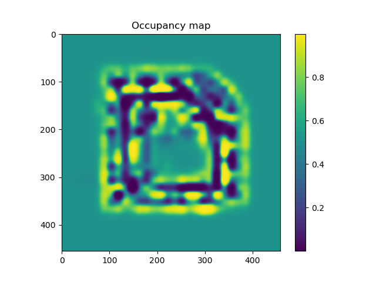

- [1. Hilbert Maps](#1-hilbert-maps)
- [2. Software Requirements](#2-software-requirements)
- [3. Running the Example](#3-running-the-example)
- [4. Command](#4-command)
- [5. Result](#5-result)
  - [5.1. Fourier](#51-fourier)
  - [5.2. Sparse](#52-sparse)
  - [5.3. nystroem](#53-nystroem)
- [6. Minor questions](#6-minor-questions)
  - [6.1. What is the process of using Random Fourier features](#61-what-is-the-process-of-using-random-fourier-features)
  - [6.2. What is](#62-what-is)
- [Issues](#issues)
  - [I find sparse is not so stable](#i-find-sparse-is-not-so-stable)
  - [I really need to select best kernel!!](#i-really-need-to-select-best-kernel)


# 1. Hilbert Maps

This repository is based on the paper "Hilbert maps: scalable continuous occupancy mapping with stochastic gradient descent" by Fabio Ramos and Lionel Ott presented in RSS 2105.

```
@INPROCEEDINGS{Ramos-RSS-15, 
    AUTHOR    = {Fabio Ramos AND Lionel Ott}, 
    TITLE     = {Hilbert maps: scalable continuous occupancy mapping with stochastic gradient descent}, 
    BOOKTITLE = {Proceedings of Robotics: Science and Systems}, 
    YEAR      = {2015}
}
```

# 2. Software Requirements

To run the code you need the following software components:

* [Python](https://www.python.org/)
* [scikit-learn](http://scikit-learn.org/stable/index.html)
* [matplotlib](http://matplotlib.org/)
* [SciPy](http://www.scipy.org/)
* [NumPy](http://www.numpy.org/)

# 3. Running the Example #

The script `example.py` is a simple way to produce a map using hilbert maps from carmen style logfiles as follows:

```
#!bash

example.py
    [-h]
    [--components COMPONENTS]
    [--gamma GAMMA]
    [--distance_cutoff DISTANCE_CUTOFF]
    [--resolution RESOLUTION]
    logfile
    {sparse,fourier,nystroem}
```
Only the `logfile` parameter and the feature type (`sparse`, `fourier`, or `nystroem`) is required. For more detailed parameter description use `example.py --help`.

For the intel dataset the following component numbers are decent starting choices.

* sparse 1000
* fourier 10000
* nystroem 1000

# 4. Command
```
python example.py datasets\intel.gfs.log nystroem
python example.py datasets\intel.gfs.log sparse
python example.py datasets\intel.gfs.log fourier

```
# 5. Result
## 5.1. Fourier

## 5.2. Sparse

## 5.3. nystroem


# 6. Minor questions
## 6.1. What is the process of using Random Fourier features 

## 6.2. What is  

# Issues 
## I find sparse is not so stable
```
test1
Training model:  99.88%
Area under curve: 0.65
Querying model:  99.99%
test2
Training model:  99.88%
Area under curve: 0.90
Querying model:  99.96%
```
## I really need to select best kernel!!
